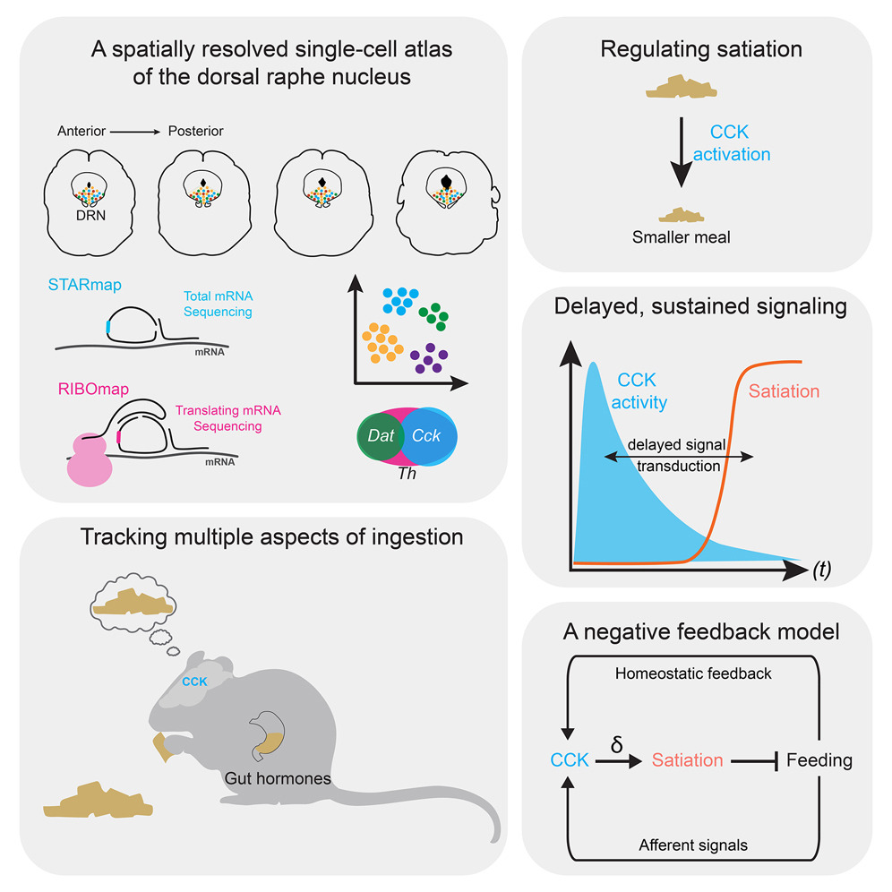

# STARmap/RIBOmap analysis in Chowdhury et al.

<!--  -->

This repository contains scripts for the '**Brainstem neuropeptidergic neurons link a neurohumoral axis to satiation**'. 

1. ```DRNSpatialSeq_1_Filtering.ipynb``` (single cell QC for STARmap/RIBOmap data)
2. ```DRNSpatialSeq_2_PreprocessingAndIntegration.ipynb``` (preprocessing and data integration)
3. ```DRNSpatialSeq_3_CellTyping.ipynb``` (cell clustering and visualization)

***

### Other Info

<!-- #### Citation

Please cite our paper if you find our work useful.: 

> [Zeng, H., Huang, J., Ren, J., Wang, C.K., Tang, Z., Zhou, H., Zhou, Y., Shi, H., Aditham, A., Sui, X. and Chen, H., 2023. Spatially resolved single-cell translatomics at molecular resolution. *Science*, *380*(6652), p.eadd3067.](https://www.science.org/doi/10.1126/science.add3067) -->

<!-- #### Related Dataset 
[](https://doi.org/10.5281/zenodo.8041114)
[](https://doi.org/10.5281/zenodo.8041323)

The related datasets can be found:
1. [Single Cell Portal](https://singlecell.broadinstitute.org/single_cell/study/SCP1835)
2. [Zenodo - Gene expression dataset](https://doi.org/10.5281/zenodo.8041114) 
3. [Zenodo - Processed image dataset](https://doi.org/10.5281/zenodo.8041323) 
* ***Please use the most recent version of the dataset.*** -->

#### Contact
Contact us at wendyw@broadinstitute.org / jiahao@broadinstitute.org if you have any issues. 


#### Contributor
Wendy (Xueyi) Wang, Jiahao Huang
